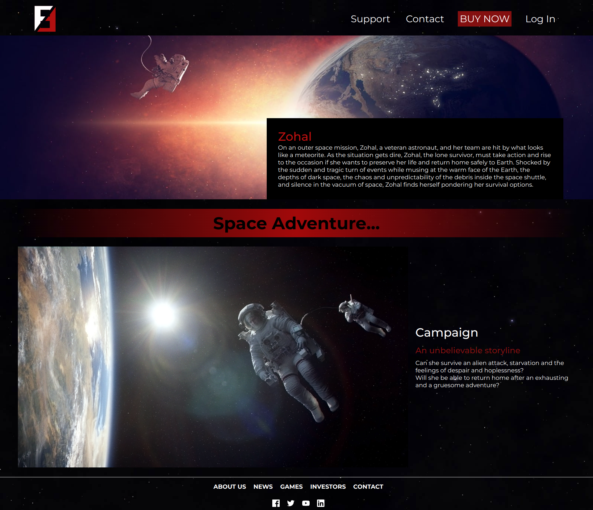

# Zohal

> Zohal (Website)
---

## Description
Zohal, is a game that takes place in space, the heroine of the game is "Zohal", and she is an astronaut who was sent on a mission to one of the space stations, but upon reaching the station they received an attack from aliens, and "Zohal" remained the only survivor looking for a way to survive.

--- 

## What's The Concept
The goal is to maintain the oxygen level, find a way to return to Earth, and survive by warning humans of aliens.
You lose the game if you run out of oxygen, or if you can't dodge the alien attacks.

---

## Installation

To play this game, you need to download it from our website, [CLICK HERE](#) to download it.

---

## Contribution
- [AbdelMasih](https://github.com/abdelmassihabed): Images resources.
- [Amen](https://github.com/amen6): Building The Website and writing README.
- [Bilal](https://github.com/belalKhaleel): Script and Graph.
- [Sarah](https://github.com/AWIKSARAH): Script, Graph and writing README.
---

## Our Website

- [Mobile-View](pictures/mobile_view.png)
- [Desktop-View](pictures/desktop_view.png)